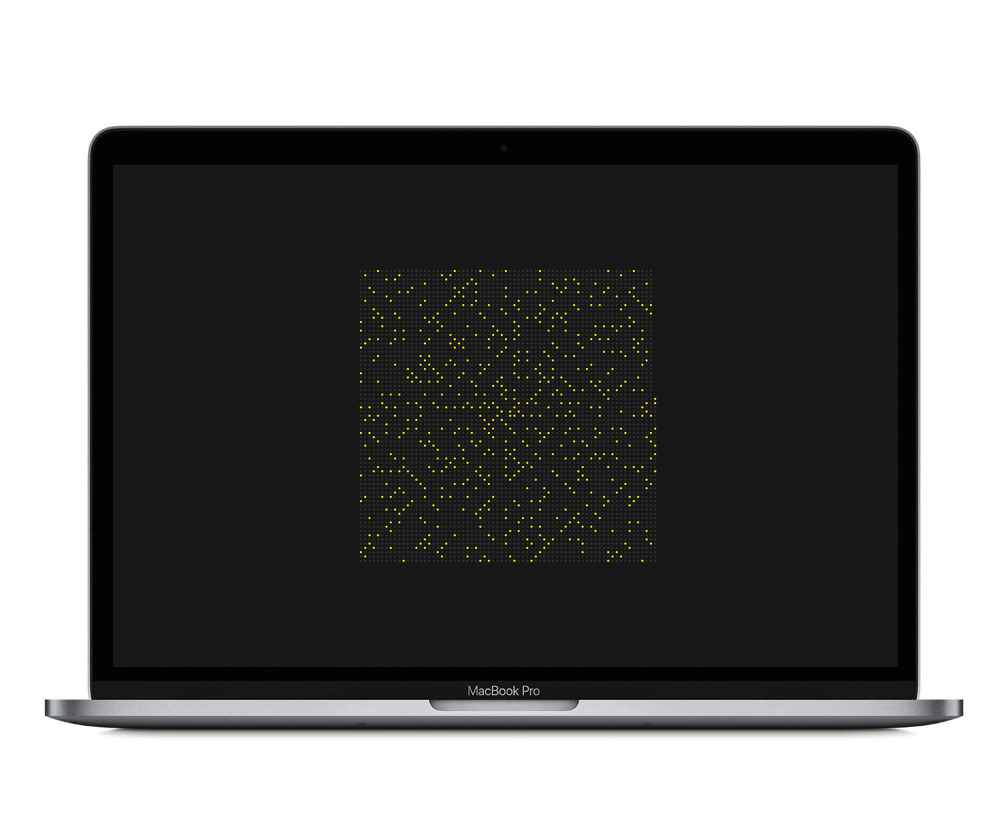

# Ulam Spiral
> Ulam Spiral Screen Saver For MacOS

	

## About

The Ulam Spiral is a graphical representation of positive prime numbers. It was discovered and named after the mathematician _Stanislaw Ulam_ in 1963. The spiral is constructed by circling counter-clockwise from an origin point on a square grid. Each traversal of a grid cell represents the next number on the positive number line. If said number is prime, it is marked. Otherwise, it is ignored. Once the algorithm is sufficiently played out, what seems like a though provoking pattern begins to appear.

## Installation

Check out the [releases](/releases) tab and download the latest version. Double click on the `.saver` file to install it. Once **Desktop & Screen Saver** preferences opens automatically, choose the **Ulam Spiral** screen saver from the list of screen savers.

## Development

You can start developing by opening the [UlamSpiral.xcodeproj](UlamSpiral.xcodeproj) file in Xcode and building the project (`⌘ + B`). You can then install the screen saver by right-clicking on the **Products/UlamSpiral.saver** file and choosing **Open With External Editor**.

## Additional Notes

If you would like to learn more about **Ulam Spirals**, check out the wikipedia [page](https://en.wikipedia.org/wiki/Ulam_spiral) on it. Additionally, _Numberphile_ made a great YouTube [video](https://www.youtube.com/watch?v=iFuR97YcSLM) covering Ulam Spirals and it is also a great resource.
